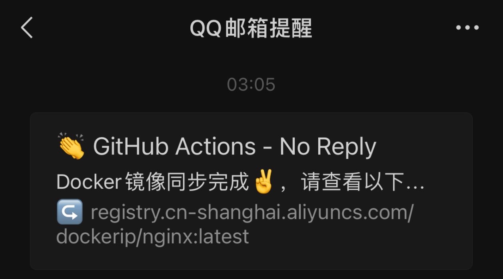

# DockerRescue

​	该项目基于 **`GitHub Actions`** 实现自动化，用于定期或修改指定文件触发同步 Docker 镜像到阿里云容器镜像服务（ACR）。


## 1 主要功能

- **自动同步镜像：** 流水线任务根据 **`docs/images.txt`** 文件中的镜像列表，自动将 Docker 镜像同步到阿里云 ACR。
- **定时触发或文件修改触发：** 可以通过定时任务或者在提交时修改了 **`docs/images.txt`** 来触发流水线。
- **指定镜像架构拉取：** 可选功能，创建 **`docs/platform.txt`** 同步指定系统的镜像。
- **邮件通知：** 可选功能，流水线执行完成后，创建 **`docs/email.txt`** 发送同步结果，通知指定的收件人。

## 2 使用方法

### 2.1 流水线触发条件

默认情况下，流水线在每次提交中修改了 **`docs/images.txt`** 文件时会触发。你也可以通过修改 **`.github/workflows/sync.yml`** 文件中的 **`paths`** 部分来调整触发条件。

```yaml
on:
  push:
    # 指定文件修改执行
    paths:
      - 'docs/images.txt'
```

若需定期最新的镜像，则将触发条件修改为定时条件即可。

```yaml
on:
  # 定时执行
  workflow_dispatch:
  schedule: 
    # 国际标准时间，北京时间需要+8小时
    - cron: '0 0 * * *'
```

### 2.2 配置密钥与参数

在项目的 **Settings** --> **Secrets andvariables** --> **Actions** 中，设置以下几个必要的密钥：

- **`ACR_USERNAME`**  和 **`ACR_PASSWORD`**: 阿里云容器镜像服务的用户名和密码。
- **`SMTP_USERNAME`** 和 **`SMTP_PASSWORD`**: 用于发送通知邮件的 SMTP 服务器的用户名和密码（授权码）。

在 **`.github/workflows/sync.yml`** 文件中，修改 **`registry.cn-shanghai.aliyuncs.com/dockerip`** 为你自己的镜像仓库地址，阿里镜像服务注册使用，请移步👉：[阿里云镜像服务（ACR）注册使用](https://github.com/iCloudBot/DockerRescue/tree/main/docs#%E9%98%BF%E9%87%8C%E4%BA%91%E9%95%9C%E5%83%8F%E6%9C%8D%E5%8A%A1acr%E6%B3%A8%E5%86%8C%E4%BD%BF%E7%94%A8)

### 2.3 修改镜像列表

在 **`docs/images.txt`** 文件中，列出需要同步到阿里云 ACR 的 Docker 镜像列表。每行一个镜像，可以指定镜像名和标签，例如：

```makefile
nginx:latest
adguard/adguardhome
python:3-slim
```

同步完成后，有镜像前缀空间的，将会被删除，例如 **`adguard/adguardhome`** → **`adguardhome`** ，示例如下：

```makefile
registry.cn-shanghai.aliyuncs.com/dockerip/nginx:latest
registry.cn-shanghai.aliyuncs.com/dockerip/adguardhome:latest
registry.cn-shanghai.aliyuncs.com/dockerip/python:3-slim
```

### 2.4 指定镜像系统架构 

默认 **`docs/platform.txt`** 文件不存在时，镜像的架构为 **`amd64`** ，同步完成后的镜像不带系统架构名称。

如果创建了 **`docs/platform.txt`** 文件（**仅支持填写单个架构**），并且填写系统架构，例如： **`386`** **`amd64`** **`arm64`** **`arm/v5`** **`arm/v7`** ，将在镜像名称后加上系统架构名称，示例如下：

```makefile
registry.cn-shanghai.aliyuncs.com/dockerip/redis-arm-v5:latest
registry.cn-shanghai.aliyuncs.com/dockerip/nginx-arm64:latest
```

### 2.5 运行流水线

每次提交或定时触发后，GitHub Actions 将自动运行流水线。你可以在 Actions 标签页查看流水线的执行情况和日志。

### 2.6 查看同步结果

如果创建了 **`docs/email.txt`** 文件（**仅支持填写单个邮箱地址**），并且填写接受人的邮箱地址，当流水线执行完成后，将会发送邮件到指定的收件人，包含同步完成的镜像地址列表。

```makefile
cleverest@qq.com
```

## 3 推荐使用

使用接口请求，主要作用是为打不开 **GitHub** 的小伙伴提供一个便捷的方式，随时随地来同步 Docker 镜像。

### 3.1 使用示例

```makefile
# 1.不接收邮件通知，请求如下：
https://cr.gitool.cn:6443/api?image_names=镜像地址1,镜像地址2,镜像地址3

# 2.不接收邮件通知请求，并且指定镜像架构，请求如下：
https://cr.gitool.cn:6443/api?image_names=镜像地址1,镜像地址2,镜像地址3&arch=系统架构(arm64、arm/v7)

# 3.接收邮件通知，请求如下：
https://cr.gitool.cn:6443/api?image_names=镜像地址1,镜像地址2,镜像地址3&email=你的邮箱

# 4.接收邮件通知，并且指定镜像架构，请求如下：
https://cr.gitool.cn:6443/api?image_names=镜像地址1,镜像地址2,镜像地址3&arch=arm/v7&email=你的邮箱
```

> 终端使用 **`curl`** 请求

```bash
curl https://cr.gitool.cn:6443/api?image_names=nginx,alpine:latest,python:3-slim,adguard/adguardhome&arch=arm64&email=cleverest@qq.com
```


> 浏览器请求


> 邮件通知截图



### 3.2 API 请求解析

- **URL**： **`https://cr.gitool.cn:6443/api？`**

- **`image_names=` 参数**：

  包含了要同步的 Docker 镜像的名称列表，多个镜像名称之间使用半角逗号分隔（,）。

  - 示例值：**`nginx,alpine:latest,python:3-slim,adguard/adguardhome`**
  - 解释：这个参数可以包含镜像名和标签（如 **`alpine:latest`**），亦可不包含镜像标签（如 **`adguard/adguardhome`**），不含标签时，默认为 **`latest`**

- **`arch=` 参数**:

  指定镜像的系统架构。

  - 示例值： **`386`** **`amd64`** **`arm64`** **`arm/v5`** **`arm/v7`** 

- **`email=` 参数**:

  指定接收通知的邮箱地址。

  - 示例值：**`cleverest@qq.com`**


## 4 注意事项

- 确保 **`docs/images.txt`** 中的镜像名与标签是正确的，并且已经存在于 Docker Hub 或其他可以访问的 Docker Registry。
- 对于Api接口 **`image_names`** **`arch`** **`email`** 参数，确保镜像名称、镜像标签、系统架构以及邮箱的格式正确，以免导致请求无法正确处理。
- 请勿恶意滥用，谢谢。

------

根据你的具体项目需求，可以进一步扩展。
